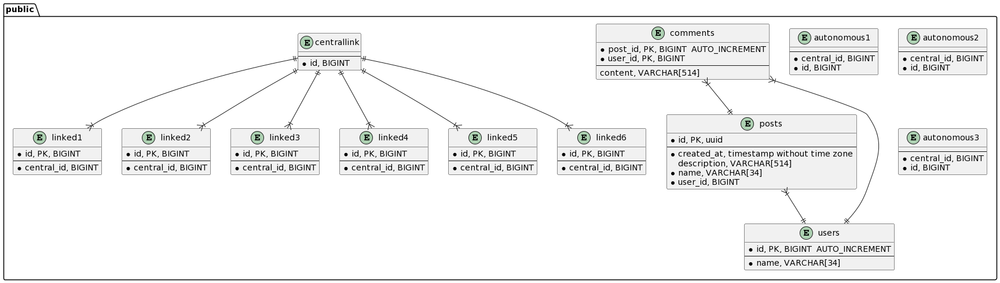

# flower


`flower` takes a SQL dump file in input and produces a PlantUML ERD diagram of the schema.

Features:
- List all tables with fields
- Indicates field types (best effort, 'unstable')
- Indicates mandatory/nullable fields
- Indicates primary keys
- Displays link between tables (0,1,N ↔ 0,1,N)

Ideas:
- Optimise parsing (atm pretty naive, remove some un-needed for loops and models, etc)
- Verify SQL schema parsing works with several `schema-dump` versions
- Add more output formatters, like Mermaidjs and potentially others?
- Fix whitespaces around type fields

## Quick start

```
bazel run //:flower -- parse --input $(pwd)/data/simple.sql --output $(pwd)/bin/out.plantuml --log-level warn
```

## Tests

```
bazel test //...
```

## Syntax

```
> bazel run //:flower -- parse --help
Run parse command

Usage:
  flower parse [flags]

Flags:
      --distance string       Distance: 'substring' or 'levenshtein' (optional)
  -h, --help                  help for parse
      --input string          Path to SQL file to read (required)
      --max-partition int     Maximum partition size (optional, default: 20) (default 20)
      --output string         Path to PlantUML file to write (including '.plantuml' extension) (required)
      --split-unconnected     Split the disconnected data graph into connected data graph, one per file. (optional, default: false)
      --weight-distance int   Weight coefficient to put over word distance weight, (optional, default: 1) (default 1)
      --weight-edge int       Weight coefficient to put between vertexes linked by edges (optional, default: 1) (default 1)
```

- `--input` is the input file path
- `--output` is the ouput file path, if several files are generated we will use the name to generate them
- `--split-unconnected` is a parameter to split an unconnected datagraph into connected parts, each file being a connected graph. The goal is to semantically split huge datagraph into several files independant from each others/
- `--distance` is an optional **experimental** parameter proposing to split a connected datagraph in several parts, using a distance for optimization computation
  - `--max-partition` is an optional parameter proposing to split the ERD in several parts of N elements, using a distance for optimization computation
  - `--weight-edge` is an optional parameter, to use alongside distance, representing the relative weight of the coefficient used for priorizing links
  - `--weight-distance` is an optional parameter, to use alongside distance, representing the relative weight of the coefficient used for priorizing the words distance
  
> [!WARNING]  
> The partitioning using distances is very experimental and doesn't work very well. I suggest using a very high `max-partition` (20/30+) and experiment with several parition size and configuration weight values to see if the ouput is coherent with your data or not.

## Example

Using file from `./data/simple.sql`:
```
> flower parse --input data/simple.sql --output bin/out.plantuml
```


## Docker build/compile

```
// build container
docker build . --tag flower:alpha
// run container
docker run -it <image_id>
// build
// make build-darwin-amd64 TODO?
// run
docker exec a7100df87d8b go run main.go -- parse --help
```

# Licence

GNU GPL v3.0