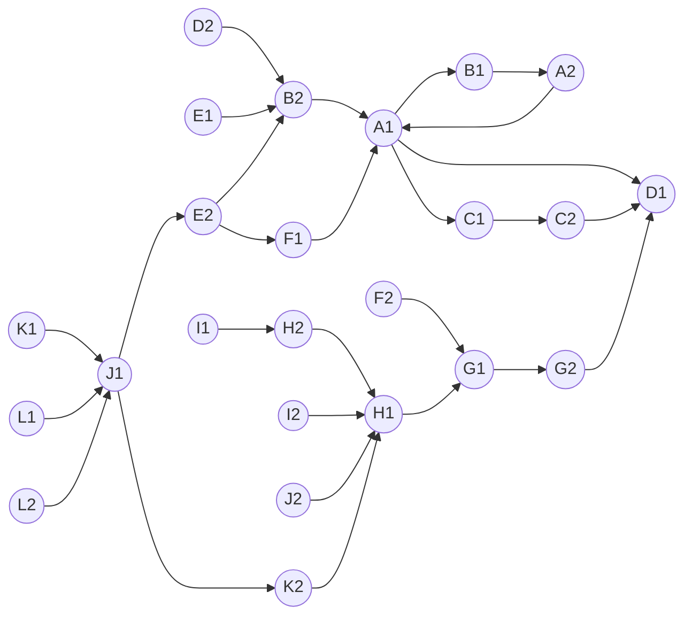
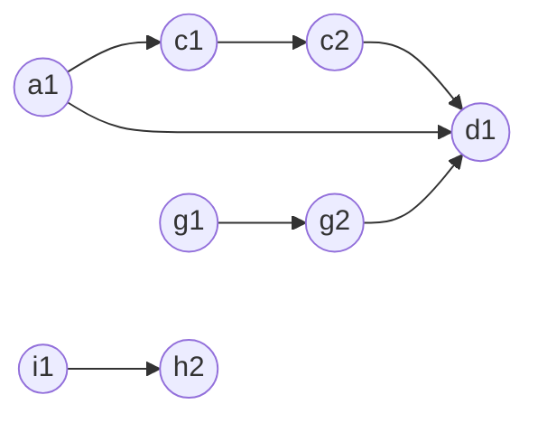
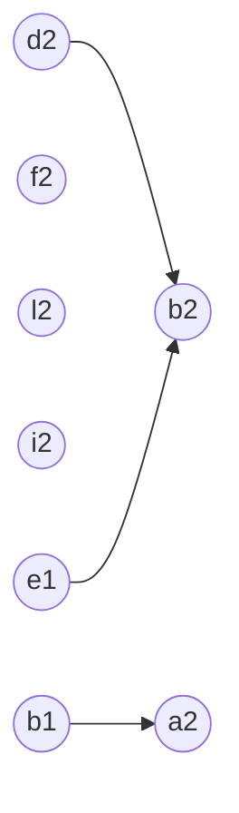
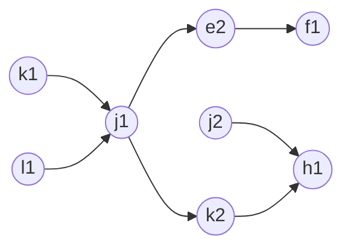

# Full example

```mermaid
flowchart LR
table_a1((A1))
table_a2((A2))
table_b1((B1))
table_b2((B2))
table_c1((C1))
table_c2((C2))
table_d1((D1))
table_d2((D2))
table_e1((E1))
table_e2((E2))
table_f1((F1))
table_f2((F2))
table_g1((G1))
table_g2((G2))
table_h1((H1))
table_h2((H2))
table_i1((I1))
table_i2((I2))
table_j1((J1))
table_j2((J2))
table_k1((K1))
table_k2((K2))
table_l1((L1))
table_l2((L2))
table_a1 --> table_b1
table_a1 --> table_c1
table_a1 --> table_d1
table_b1 --> table_a2
table_a2 --> table_a1
table_c1 --> table_c2
table_c2 --> table_d1
table_b2 --> table_a1
table_d2 --> table_b2
table_e1 --> table_b2
table_e2 --> table_b2
table_f1 --> table_a1
table_e2 --> table_f1
table_f2 --> table_g1
table_h2 --> table_h1
table_i2 --> table_h1
table_j2 --> table_h1
table_k2 --> table_h1
table_h1 --> table_g1
table_g1 --> table_g2
table_g2 --> table_d1
table_i1 --> table_h2
table_j1 --> table_e2
table_j1 --> table_k2
table_k1 --> table_j1
table_l1 --> table_j1
table_l2 --> table_j1
```

## CASE 1

- link 1
- word 0

### graph 1

```mermaid
flowchart LR
table_a1((a1)) 
table_c2((c2))
table_c1((c1))
table_h2((h2))
table_d1((d1))
table_g2((g2))
table_g1((g1))
table_i1((i1))
table_a1 --> table_c1
table_a1 --> table_d1
table_c1 --> table_c2
table_c2 --> table_d1
table_g1 --> table_g2
table_g2 --> table_d1
table_i1 --> table_h2
```

### graph 2

```mermaid
flowchart LR
table_e1((e1))
table_f2((f2))
table_l2((l2))
table_i2((i2))
table_b1((b1))
table_b2((b2))
table_d2((d2))
table_a2((a2))
table_b1 --> table_a2
table_d2 --> table_b2
table_e1 --> table_b2
```

### graph 3

```mermaid
flowchart LR
table_k1((k1))
table_h1((h1))
table_f1((f1))
table_j1((j1))
table_l1((l1))
table_j2((j2))
table_k2((k2))
table_e2((e2))
table_e2 --> table_f1
table_j2 --> table_h1
table_k2 --> table_h1
table_j1 --> table_e2
table_j1 --> table_k2
table_k1 --> table_j1
table_l1 --> table_j1
```